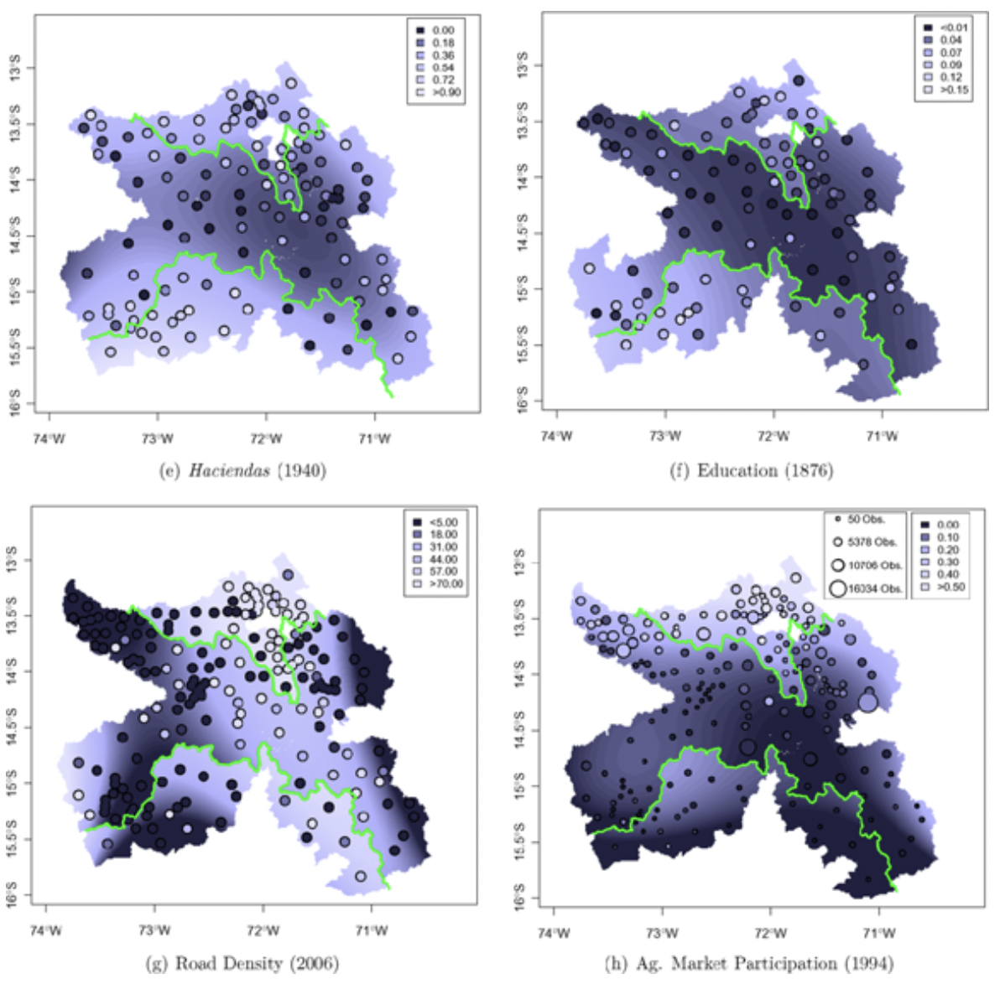
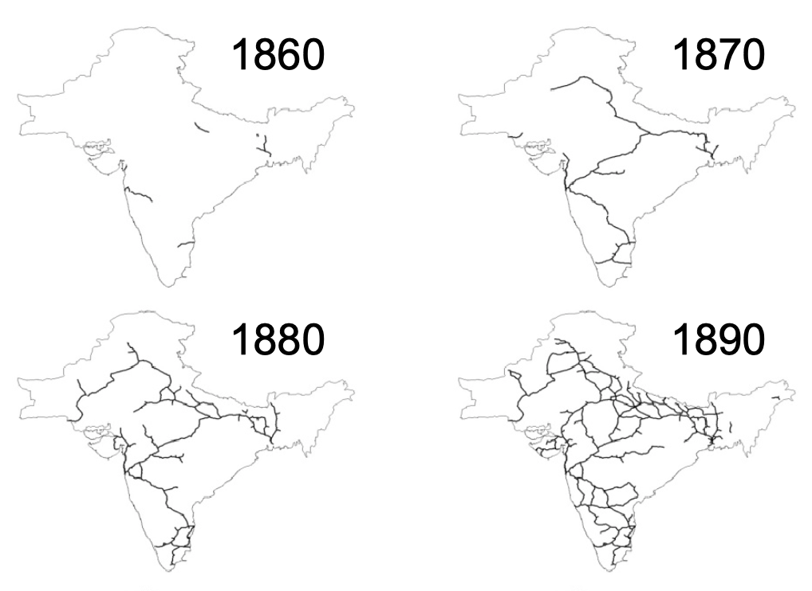
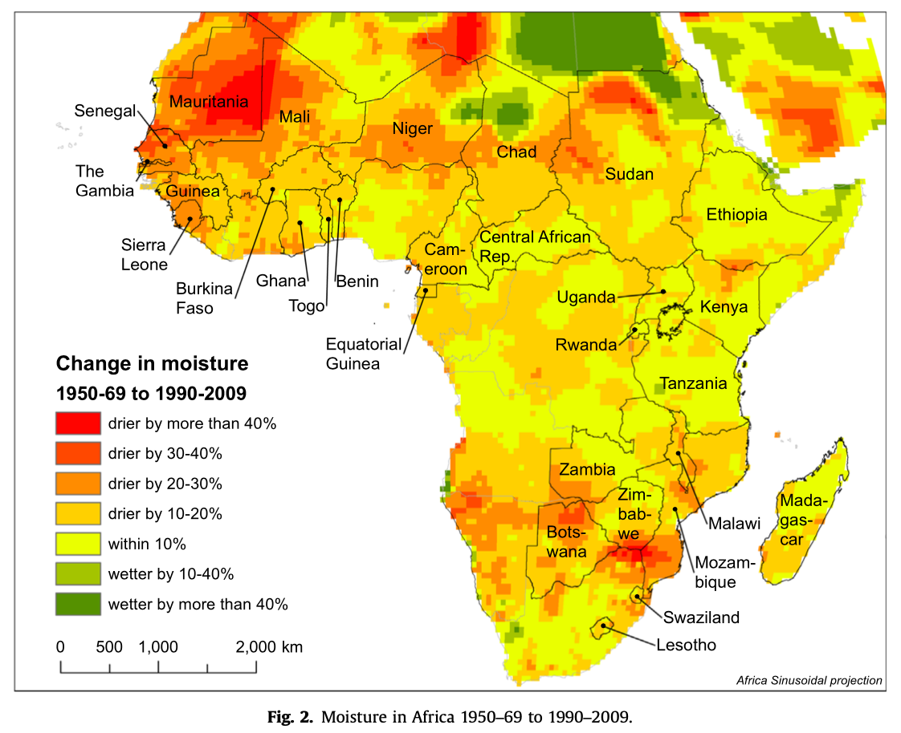
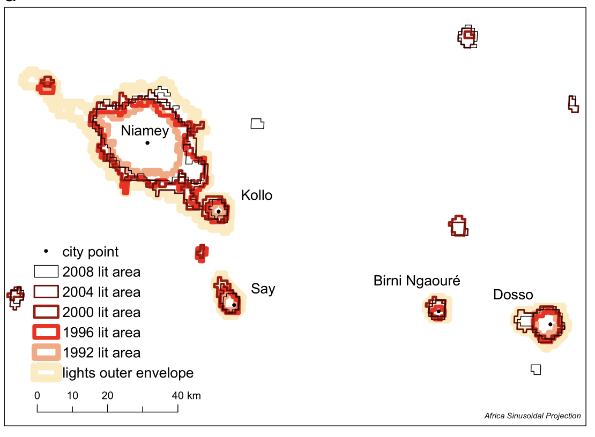
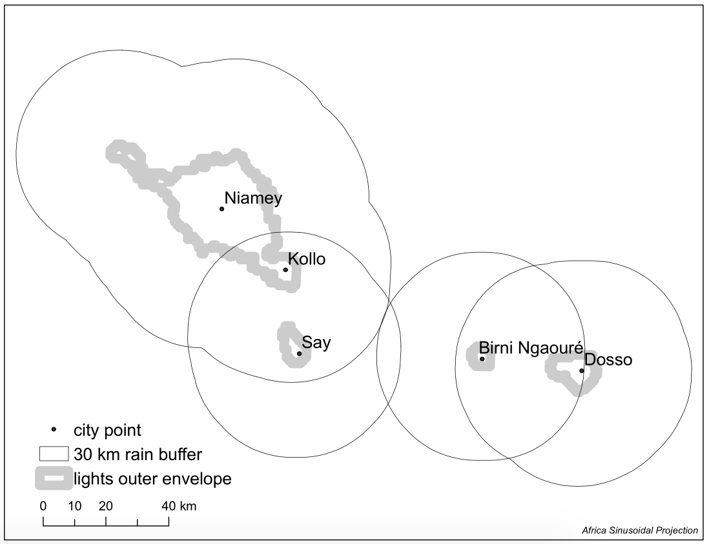

```{r setup, include=FALSE}
options(htmltools.dir.version = FALSE)

# library(xaringanthemer)
# # style_mono_accent(
# #   base_color = "#1c5253"
# #   # header_font_google = google_font("Josefin Sans"),
# #   # text_font_google   = google_font("Montserrat", "300", "300i"),
# #   # code_font_google   = google_font("Fira Mono")
# # )
# # style_xaringan(link_color = 'red')
# style_xaringan(
#   text_font_family = "Droid Serif",
#   text_font_url = "https://fonts.googleapis.com/css?family=Droid+Serif:400,700,400italic",
#   header_font_google = google_font("Yanone Kaffeesatz")
# )
# other colors:
# blue: rgb(0,114,178)
# orange: rgb(213,94,0)
# green: rgb(0,158,115)
```

# Spatial data in economics: this course

- Introduce students to conceptual and practical aspects of <span style="color: rgb(0,114,178)">**spatial data**</span></br>
    - What is spatial (geographical) data?
    - How is it used in <span style="color: rgb(0,114,178)">**research in economics**</span>?
    - Which tools (i.e. computer systems/languages) do we need to work with it?
    
- Main goal: <span style="color: rgb(213,94,0)">concepts + tools</span> = practice with real-world data
    - Concepts: types and formats of spatial data
    - Tools: programming in ``R`` and ``RStudio``
    
- Course's **main philosophy**: a course by an <span style="color: rgb(0,158,115)">economist working with spatial data</span>
    - Rather than a course by a spatial data's specialist!
    
---

# Spatial data in economics: this course

This course is about how we, (in principle) **economists**, can use spatial data to empirically answer <span style="color: rgb(213,94,0)">reserch questions of our interest</span>.

.pull-left[
**You will learn**
- What is spatial data and its applications in economic research

- Basic `R` programming

- Most common spatial data operations

- Introductory (spatial) data visualization
]

.pull-right[
**You will not learn**
- All state-of-art GIS tools available in `R`

- To write an efficient `R` code<sup>*</sup>

- To handle big data<sup>*</sup>

- To solve every possible problem
]

.footnote[
[*] This is up to you.
]

---

# Spatial data in economics: this course

## Good references

1. Lovelace, R., Nowosad, J. and Muenchow, J., 2019. Geocomputation with R. Chapman and Hall/CRC.

2. Pebesma, E., 2018. Simple Features for R: Standardized Support for Spatial Vector Data. The R Journal 10 (1), 439-446, https://doi.org/10.32614/RJ-2018-009

3. Wickham, H. and Grolemund, G., 2016. R for data science: import, tidy, transform, visualize, and model data. " O'Reilly Media, Inc.".

---

# Spatial data in economics: schedule

1. Introduction to (spatial) data and programming in `R` &nbsp;&nbsp;&nbsp;&nbsp;&nbsp;&nbsp; [14.Feb.2023]
    - Introduction to spatial data and examples in economics
    - Basic `R` programming: set up and practice

2. Spatial data basics: vector data <span style="color: rgb(0,114,178)">+ assignment</span> &nbsp;&nbsp;&nbsp;&nbsp;&nbsp;&nbsp;&nbsp;&nbsp;&nbsp;&nbsp;&nbsp;&nbsp;&nbsp;&nbsp;&nbsp;&nbsp;&nbsp;&nbsp;&nbsp; [21.Feb.2023]

3. Basic operations with vector data <span style="color: rgb(0,114,178)">+ assignment</span> &nbsp;&nbsp;&nbsp;&nbsp;&nbsp;&nbsp;&nbsp;&nbsp;&nbsp;&nbsp;&nbsp;&nbsp;&nbsp;&nbsp; [28.Feb.2023]

4. Geometry operations and miscelanea <span style="color: rgb(213,94,0)">+ follow-up</span> &nbsp;&nbsp;&nbsp;&nbsp;&nbsp;&nbsp;&nbsp;&nbsp;&nbsp;&nbsp; [07.Mar.2023]

5. Raster data and operations <span style="color: rgb(0,114,178)">+ assignment</span> &nbsp;&nbsp;&nbsp;&nbsp;&nbsp;&nbsp;&nbsp;&nbsp;&nbsp;&nbsp;&nbsp;&nbsp;&nbsp;&nbsp;&nbsp;&nbsp;&nbsp;&nbsp;&nbsp;&nbsp;&nbsp;&nbsp;&nbsp;&nbsp;&nbsp; [14.Mar.2023]<br> <br>

6. <span style="color: rgb(0,158,115)">Take-home exam</span> &nbsp;&nbsp;&nbsp;&nbsp;&nbsp;&nbsp;&nbsp;&nbsp;&nbsp;&nbsp;&nbsp;&nbsp;&nbsp;&nbsp;&nbsp;&nbsp;&nbsp;&nbsp;&nbsp;&nbsp;&nbsp;&nbsp;&nbsp;&nbsp;&nbsp;&nbsp;&nbsp;&nbsp;&nbsp;&nbsp;&nbsp;&nbsp;&nbsp;&nbsp;&nbsp;&nbsp;&nbsp;&nbsp;&nbsp;&nbsp;&nbsp;&nbsp;&nbsp;&nbsp;&nbsp;&nbsp;&nbsp;&nbsp;&nbsp;&nbsp;&nbsp;&nbsp;&nbsp;&nbsp;&nbsp;&nbsp;&nbsp;&nbsp;&nbsp;&nbsp;&nbsp;&nbsp;&nbsp;&nbsp;&nbsp;&nbsp;&nbsp;&nbsp;&nbsp; [12.Apr.2023]

---

# Spatial data in economics: evaluation

1. Class participation (10%)

2. Practical assignments (3 x 10%, in teams)

3. <span style="color: rgb(0,158,115)">Take-home exam</span> (60%, `pdf` by email):
  - Research idea: spatial data + economics = **research question**
  
  - Replication of tasks: data + tools = empirical motivation

- Any <span style="color: rgb(213,94,0)">questions</span>?

---

# Spatial data in economics: logistics

- Classes: every Tue from 17(:15)-20:00 pm
    - 1 hour theory + 15' break + 1 hour practice (hands-in)

- Course material: <u>[webpage](https://brunoconteleite.github.io/about/Spatial-2022-23-Syllabus.html)</u>

- Office hours: by appointment (write me an email!)
    
- Potentially mixed backgroud: **be patient**!

## Hands-in sessions:

- Your own computer + `RStudio`:
  - We will set it up together!

- Any <span style="color: rgb(213,94,0)">questions</span>?

---
class: inverse, center, middle
count: false

# Getting started: what is Spatial Data?

---
background-image: url(https://www.edmaps.com/europe_1789_excelsior_d.jpg)
background-size: cover
class: center, bottom, inverse
# Europe in 1789 (before the French Revolution)

---
background-image: url(https://www.edmaps.com/europe_1812_excelsior_d.jpg)
background-size: cover
class: center, bottom, inverse
# Europe in 1812 (before the French Invasion of Russia)

---
background-image: url(https://www.edmaps.com/europe_1815_excelsior_d.jpg)
background-size: cover
class: center, bottom, inverse
# Europe in 1815 (after the Congress of Vienna)

---
background-image: url(https://hsat.space/wp-content/uploads/2020/08/brazil_planet_-6.35-53.55-768x512-1.jpg)
background-size: cover
class: center, bottom, inverse
# Satellite picture of fires (and deforestation) in the Brazilian Amazon

???
Source: https://hsat.space/satellites-deforestation/

---
background-image: url(https://maaproject.org/wp-content/uploads/2021/01/maaproject.org-maap-132-amazon-deforestation-hotspots-2020-HS2-PFL-Amz-Biog2020-GLAD-Confirm-2-5-10-v3-Eng.jpg)
background-size: contain
class: center, top, inverse
# Deforestation in the Brazilian Amazon

???
Source: https://maaproject.org/2021/amazon-hotspots-2020/

---
background-image: url(https://www.researchgate.net/publication/343842128/figure/fig1/AS:928229292511232@1598318517654/A-comparison-of-the-inter-and-intra-urban-variability-of-slums-Image-a-shows-a-typical.ppm)
background-size: contain
class: center, bottom, inverse
# Urban slums in India

???
Source: https://www.researchgate.net/figure/A-comparison-of-the-inter-and-intra-urban-variability-of-slums-Image-a-shows-a-typical_fig1_343842128

---

# What is Spatial Data?

- Data/information that has a <span style="color: rgb(213,94,0)">geographical attribute</span>
  - **Much more** than coordinates on a standard dataset
  
  - Polygons, areas, distances, height, overlaying, intersections, ...

--

.pull-left[
- Common aspect: **<span style="color: rgb(0,158,115)">unstructured data</span>** (i.e. unconventional data format)

&nbsp;&nbsp;&nbsp;&nbsp;&nbsp;&nbsp;&nbsp;&nbsp;&nbsp;&nbsp;&nbsp;&nbsp;&nbsp;&nbsp;&nbsp;&nbsp;&nbsp;&nbsp;&nbsp;&nbsp;
]

.pull-right[
- Our goal: manipulate it into the **<span style="color: rgb(0,114,178)">structure</span>** required by research

 

]

---

# What is GIS?

- GIS = <span style="color: rgb(0,114,178)">Geographic Information Systems</span>
    - (old) Systems used to manipulate/process spatial data (**1980's**)
    
    - 1990's: rise of user-friendly, **desktop softwares** (ArcGIS, QGIS)
    
    - <span style="color: rgb(213,94,0)">Data Science revolution:</span>  full integration of GIS tools into data-processing pipelines; i.e. computer routines that process (potentially spatial) data in <span style="color: rgb(0,158,115)">modern languages</span> (e.g. `R`)
    
- **Examples:**
    - Firm processing purchases across branches
      - Is revenue larger in branches *closer to public transportation?*
      
    - HR firm allocating seasonal workers across plants
      - Choose workers based on residence (reduce commuting time)?

---

# Why not GIS in desktop, user-friendly, softwares?

Require human interaction (e.g. clicking, moving files) to <span style="color: rgb(0,114,178)">structure spatial data</span>.

.pull-left[
.center[**GIS in 1980's:**


]
]

.pull-right[
.center[**ArcGIS/QGIS:**]


]

---
class: inverse, center, middle
count: false

# How is Spatial Data used in Economics?

---

# Spatial Data in Economics

- **Motivation:** research questions that requires structuring spatial data.
  - Spatial data = unstructured
  
  - GIS tools: manipulating spatial data to the required structure
  
- <span style="color: rgb(213,94,0)">Applications in economic research:</span>
  - Cholera in London (Snow, 1856)
  
  - Colonial institutions and development in Peru (Dell, 2010)
  
  - Railroads and welfare in India (Donaldson, 2018)
  
  - Climate change and urbanization in Africa (Henderson et al., 2017)

---

# Application 01: John Snow's Cholera Maps in Soho (London)


.pull-left[
.center[

]
]

.pull-right[
- **Cholera outbreak** in mid 19th century

- Former theory: transmission by air

- John Snow's hypothesis: <span style="color: rgb(0,114,178)">germ-contaminated water</span>
  - Different rates between locations with different water suppliers
  
  - Higher rates for those <span style="color: rgb(213,94,0)">supplied by (polluted) Thames River</span>
  
- Snow's finding: revolution on public sanitation

]

---

# Application 02: Long-term consequences of the Mita (colonial) system in Peru


.pull-left[
.center[

]
]

.pull-right[
- Spanish empire required **forced labor** to work on silver mines (Potosí)

- Workers from high lands (Mita regions): resistent to the harsh mine conditions

- Mita boundaries: regions that <span style="color: rgb(213,94,0)">provided more/less conscripts</span> (discontinuously!)
  
- **Dell's findings:** long-lasting <span style="color: rgb(0,158,115)">development differences</span>
  - <span style="color: rgb(0,114,178)">Economic channels:</span> land ownership inequality, less public services, ...

]

---
count: false

# Application 02: Long-term consequences of the Mita (colonial) system in Peru


.pull-left[
.center[

]
]

.pull-right[
- Spanish empire required **forced labor** to work on silver mines (Potosí)

- Workers from high lands (Mita regions): resistent to the harsh mine conditions

- Mita boundaries: regions that <span style="color: rgb(213,94,0)">provided more/less conscripts</span> (discontinuously!)
  
- **Dell's findings:** long-lasting <span style="color: rgb(0,158,115)">development differences</span>
  - <span style="color: rgb(0,114,178)">Economic channels:</span> land ownership inequality, less public services, ...

]

---

# Application 03: Transportation integration and welfare in India


.pull-left[
.center[

]
]

.pull-right[
- Vast **expansion of railroad network** in British colonial India

- Standard trade theory: <span style="color: rgb(0,114,178)">welfare gains from market integration</span>
  - Lack of evidence within countries

- **Donaldson's findings:** improved trade conditions increased welfare
  - <span style="color: rgb(0,158,115)">Integrated remote areas</span> (reduced price gaps, more trade flows)
  
  - <span style="color: rgb(213,94,0)">Welfare gains</span> (real income) from intraregional trade

 

]

---

# Application 04: Climate change and urbanization in Africa


.pull-left[
.center[

]
]

.pull-right[
- **Increased dryness in Africa** (worse conditions for agriculture)

- Question: do agents in affected rural regions <span style="color: rgb(0,114,178)">migrate to cities?</span>

- **Henderson et al.'s findings:** depends on <span style="color: rgb(213,94,0)">industry composition of cities</span>
  - Increased size (**nightlights**) in manufacturing, exporting cities
  
  - Opposite evidence for market towns (service providers to agriculture)
  
  - Importance of <span style="color: rgb(0,158,115)">structural change!</span>
]


---
count: false

# Application 04: Climate change and urbanization in Africa


.pull-left[
.center[

]
]

.pull-right[
- **Increased dryness in Africa** (worse conditions for agriculture)

- Question: do agents in affected rural regions <span style="color: rgb(0,114,178)">migrate to cities?</span>

- **Henderson et al.'s findings:** depends on <span style="color: rgb(213,94,0)">industry composition of cities</span>
  - Increased size (**nightlights**) in manufacturing, exporting cities
  
  - Opposite evidence for market towns (service providers to agriculture)
  
  - Importance of <span style="color: rgb(0,158,115)">structural change!</span>

]

---
count: false

# Application 04: Climate change and urbanization in Africa


.pull-left[
.center[

]
]

.pull-right[
- **Increased dryness in Africa** (worse conditions for agriculture)

- Question: do agents in affected rural regions <span style="color: rgb(0,114,178)">migrate to cities?</span>

- **Henderson et al.'s findings:** depends on <span style="color: rgb(213,94,0)">industry composition of cities</span>
  - Increased size (**nightlights**) in manufacturing, exporting cities
  
  - Opposite evidence for market towns (service providers to agriculture)
  
  - Importance of <span style="color: rgb(0,158,115)">structural change!</span>

]

---
class: inverse, center, middle
count: false

# How to work with spatial data in R?

---

# Working with data (including spatial) in R

- What is `R`? 
  - Computer language for statistical computing and graphics
  
  - Open source, <span style="color: rgb(0,114,178)">free access</span>
  
  - Developers' community (CRAN)
      - Development of **libraries** (packages) for <span style="color: rgb(213,94,0)">specific applications</span>
    
- `RStudio`: integrated development environment (IDE)
  - <span style="color: rgb(0,158,115)">User-friendlier environment</span> to work with `R`
  
---

# Working with data (including spatial) in R

- Data work in `R`: one of its <span style="color: rgb(0,114,178)">many capabilities</span>
  - Producing documents, slides, or webpages
  
- **Our approach:**
  1. <span style="color: rgb(0,114,178)">Basic programming and data work</span> in `R` $\rightarrow$ **content of today!**
  
  2. Working with spatial data in `R` (GIS tools)
  
- Important: <span style="color: rgb(213,94,0)">focus on basics</span>
  - Introduction of basic concepts/tools rather than a presentation of **all possible** functions
  
  - Every GIS application is a challenge on its own
      - The goal is to introduce the basics so that you can apply (and improve) them on <span style="color: rgb(0,158,115)">your own application!</span>

---
class: inverse, center, middle
count: false

# R Basics

---

# Basics of programming and data work in R


---
count: false

# References

- Dell, M., 2010. The persistent effects of Peru's mining mita. *Econometrica*, *78(6)*, pp.1863-1903.

- Donaldson, D., 2018. Railroads of the Raj: Estimating the impact of transportation infrastructure. *American Economic Review*, *108(4-5)*, pp.899-934.

- Henderson, J.V., Storeygard, A. and Deichmann, U., 2017. Has climate change driven urbanization in Africa?. *Journal of development economics*, *124*, pp.60-82.

- Snow, J., 1856. On the mode of communication of cholera. *Edinburgh medical journal*, *1(7)*, p.668.


