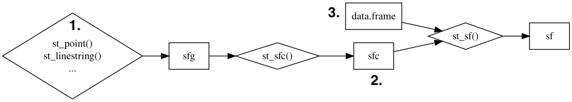

```{r setup, include=FALSE}
options(htmltools.dir.version = FALSE)

# library(xaringanthemer)
# # style_mono_accent(
# #   base_color = "#1c5253"
# #   # header_font_google = google_font("Josefin Sans"),
# #   # text_font_google   = google_font("Montserrat", "300", "300i"),
# #   # code_font_google   = google_font("Fira Mono")
# # )
# # style_xaringan(link_color = 'red')
# style_xaringan(
#   text_font_family = "Droid Serif",
#   text_font_url = "https://fonts.googleapis.com/css?family=Droid+Serif:400,700,400italic",
#   header_font_google = google_font("Yanone Kaffeesatz")
# )
# other colors:
# blue: rgb(0,114,178)
# orange: rgb(213,94,0)
# green: rgb(0,158,115)
```

class: inverse, center, title-slide, middle

<style>
.title-slide .remark-slide-number {
  display: none;
}
</style>

# Lecture 02: Spatial Data

## Theory and Tools (a.k.a. GIS Tools Lab.)

### <br><br>Bruno Conte

### 21/Feb/2023

---

# Spatial data in economics: schedule

1. ~~Introduction to (spatial) data and programming in `R`~~ &nbsp;&nbsp;&nbsp;&nbsp;&nbsp;&nbsp; [14.Feb.2023]

2. Spatial data basics: vector data <span style="color: rgb(0,114,178)">+ assignment</span> &nbsp;&nbsp;&nbsp;&nbsp;&nbsp;&nbsp;&nbsp;&nbsp;&nbsp;&nbsp;&nbsp;&nbsp;&nbsp;&nbsp;&nbsp;&nbsp;&nbsp;&nbsp;&nbsp; [21.Feb.2023]
    - Spatial data types (vector and raster) and data files
    - Basics of **vector data**: generating, wrangling, visualizing, exporting
    - Working with external files: loading, processing, exporting

3. Basic operations with vector data <span style="color: rgb(0,114,178)">+ assignment</span> &nbsp;&nbsp;&nbsp;&nbsp;&nbsp;&nbsp;&nbsp;&nbsp;&nbsp;&nbsp;&nbsp;&nbsp;&nbsp;&nbsp; [28.Feb.2023]

4. Geometry operations and miscelanea <span style="color: rgb(213,94,0)">+ follow-up</span> &nbsp;&nbsp;&nbsp;&nbsp;&nbsp;&nbsp;&nbsp;&nbsp;&nbsp;&nbsp; [07.Mar.2023]

5. Raster data and operations <span style="color: rgb(0,114,178)">+ assignment</span> &nbsp;&nbsp;&nbsp;&nbsp;&nbsp;&nbsp;&nbsp;&nbsp;&nbsp;&nbsp;&nbsp;&nbsp;&nbsp;&nbsp;&nbsp;&nbsp;&nbsp;&nbsp;&nbsp;&nbsp;&nbsp;&nbsp;&nbsp;&nbsp;&nbsp; [14.Mar.2023]<br> <br>

6. <span style="color: rgb(0,158,115)">Take-home exam</span> &nbsp;&nbsp;&nbsp;&nbsp;&nbsp;&nbsp;&nbsp;&nbsp;&nbsp;&nbsp;&nbsp;&nbsp;&nbsp;&nbsp;&nbsp;&nbsp;&nbsp;&nbsp;&nbsp;&nbsp;&nbsp;&nbsp;&nbsp;&nbsp;&nbsp;&nbsp;&nbsp;&nbsp;&nbsp;&nbsp;&nbsp;&nbsp;&nbsp;&nbsp;&nbsp;&nbsp;&nbsp;&nbsp;&nbsp;&nbsp;&nbsp;&nbsp;&nbsp;&nbsp;&nbsp;&nbsp;&nbsp;&nbsp;&nbsp;&nbsp;&nbsp;&nbsp;&nbsp;&nbsp;&nbsp;&nbsp;&nbsp;&nbsp;&nbsp;&nbsp;&nbsp;&nbsp;&nbsp;&nbsp;&nbsp;&nbsp;&nbsp;&nbsp;&nbsp; [12.Apr.2023]

---

# Main references for this class

1. Lovelace, R., Nowosad, J. and Muenchow, J., 2019. <span style="color: rgb(0,114,178)">**Geocomputation with R.**</span> Chapman and Hall/CRC.

2. Pebesma, E., 2018. Simple Features for R: Standardized Support for Spatial Vector Data. The R Journal 10 (1), 439-446

3. Wickham, H. and Grolemund, G., 2016. R for data science: import, tidy, transform, visualize, and model data. " O'Reilly Media, Inc.".

---

# Spatial data types: vector and raster

- GIS systems represent spatial data in either <span style="color: rgb(0,114,178)">vector</span> or <span style="color: rgb(0,114,178)">raster</span> formats
  - **Vector data:** spatial geometries as a collection of points over a geography
  
  - Can represent <span style="color: rgb(213,94,0)">different objects</span> (points, lines, polygons, multiobjects)

.center[

]

---
count: false

# Spatial data types: vector and raster

- GIS systems represent spatial data in either <span style="color: rgb(0,114,178)">vector</span> or <span style="color: rgb(0,114,178)">raster</span> formats
  - **Vector data:** spatial geometries as a collection of points over a geography
  
  - Can represent <span style="color: rgb(213,94,0)">different objects</span> (points, lines, polygons, multiobjects)

.center[

]

---

# Spatial data types: vector and raster

- GIS systems represent spatial data in either <span style="color: rgb(0,114,178)">vector</span> or <span style="color: rgb(0,114,178)">raster</span> formats
  - **Raster data:** geography as continuos of pixels (gridcells) with associated values
  
  - Normally represents <span style="color: rgb(213,94,0)">high resolution</span> features of the geography (like an image)

.center[

]

---

# Spatial data types: vector and raster

- Normally represents <span style="color: rgb(213,94,0)">high resolution</span> features of the geography (like an image)

.center[

]

---

# Spatial data files: vector and raster

- **Vector data:** file packages (usually multifiles)
  - Shapefiles (`*.shp`), contains also several auxiliar files (e.g. `*.dbf`, `*.shx`). <span style="color: rgb(213,94,0)">Most used!</span>
  
  - GeoJSON (`.json`) is written in Javascript (used mostly in web interfaces)
  
  - Geopackage (`*.gpk`), unique package/file
  
  - KMZ (`*.kmz`), from Google Earth format
  
- **Raster data:** imagery
  - `*.tiff` (most used)
  
  - Other image files (e.g. `jpeg`, `gif`, `png`)
  
  - NetCDF files (`*.nc`) standardized data for geoscience (CDF = common data format) 
  
---

# Spatial data: sources

There is almost **infinite** availability of spatial data in the internet. Here is a non-comprehensive list:

.pull-left[
- <u>[Natural Earth:](https://www.naturalearthdata.com/downloads/)</u> immense GIS database
- <u>[SAGE:](https://sedac.ciesin.columbia.edu/data/sets/browse)</u> also large GIS databse
- <u>[DIVA:](https://www.diva-gis.org/gdata)</u> nice GIS database by country
- <u>[GADM:](https://gadm.org/data.html)</u> country boundaries (ADM0-4)
- <u>[USGS:](https://earthexplorer.usgs.gov/)</u> satellite imagery
- <u>[Modis:](https://www.earthdata.nasa.gov/learn/find-data/near-real-time/rapid-response/modis-subsets)</u> satellite imagery
- <u>[STRM:](https://dwtkns.com/srtm/)</u> elevation
- <u>[SAGE:](https://sage.nelson.wisc.edu/data-and-models/datasets/)</u> land cover
- <u>[GFC:](http://earthenginepartners.appspot.com/science-2013-global-forest/download_v1.1.html)</u> forest change
- <u>[gROADS:](https://sedac.ciesin.columbia.edu/data/collection/groads)</u> road networks
- <u>[Mineral Resources:](https://mrdata.usgs.gov/mrds/)</u> location of minerals
]
.pull-right[
- <u>[AQUASTAT:](https://www.fao.org/aquastat/en/databases/)</u> water-related data
- <u>[FAO-GAEZ:](https://gaez.fao.org/)</u> farm/land-related data
- <u>[Harvest Choice:](https://www.ifpri.org/project/harvestchoice)</u> farm/land-related data
- <u>[mapSPAM:](https://dataverse.harvard.edu/dataset.xhtml?persistentId=doi:10.7910/DVN/PRFF8V)</u> farm/land-related data
- <u>[PS Lab:](https://psl.noaa.gov/data/gridded/index.html)</u> temperature/precipitation
- <u>[SPEI:](https://spei.csic.es/database.html)</u> drought index
- <u>[LSMS:](https://www.worldbank.org/en/programs/lsms)</u> geocoded surveys
- <u>[DHS surveys:](https://dhsprogram.com/data/)</u> geocoded surveys
- <u>[Geographic names:](https://geographic.org/geographic_names/index.html)</u> to geocode localities
- <u>[Long-lat:](https://www.latlong.net/convert-address-to-lat-long.html)</u> API to geocode by names
]
  
---
class: inverse, center, middle
count: false

# Getting started: Vector data

# and the Simple Features in R

---

# Vector data and geographical projections

.pull-left[
- **Vector:** <span style="color: rgb(0,114,178)">collection of points</span> over a geography (longitude-latitude; i.e. X-Y)
 
- X-Y geographical axis: change depending on the <span style="color: rgb(213,94,0)">geographical projection</span>

- Same geometry can be represented by different combination of X-Y points

- <span style="color: rgb(0,114,178)">Important takeaways:</span>
  1. Know the data's projection system
  2. Standardize them in you applications
 
 
]

.pull-right[

]

---

# Vector data and geographical projections

- **Most usual is WGS 84:** longitude (-180,180), latitude (-90,90); <span style="color: rgb(0,114,178)">CRS code EPSG:4326</span>

- CRS = Coordinate Reference System (synonym to geographical projection)

.center[

]

---

# Vector data in R: the simple features package

.pull-left[
- Spatial data in R: a <span style="color: rgb(213,94,0)">Simple Feature</span><br>(the `sf` library)

- State-of-art, standardized set of functions for GIS tasks

- Replace "old" libraries (e.g. `sp`, `rgdal`)

- <span style="color: rgb(0,114,178)">Revolution on GIS in R</span> (`#RSpatial`)
  - Interacts with `dplyr` "pipe" syntax
  
  - Computational- and memory-efficiency gains

]
.pull-right[
.center[
Downloads of `R` libraries:<br>


]
]

---

# Vector data in R: the simple features package

- **Core elements of a Simple Feature:**
  1. <span style="color: rgb(0,114,178)">Geometry</span> (point, lines, polygons): a collection of points (`sfg`, simple feature geometry)
  
  2. <span style="color: rgb(213,94,0)">Projection:</span> a CRS parameter that places the points over the world's geography (`sfc`, simple feature column)
  
  3. <span style="color: rgb(0,158,115)">Attributes:</span> data associated with each feature/observation (1+2+3 = `sf`: simple feature)
<br><br>

.center[

]


---

# Vector data in R: the simple features package

- Representation of a Simple Feature in `R` console
.center[

]

---

# Vector data in R: creating simple features

1. Creating <span style="color: rgb(0,114,178)">geometries:</span>
  - Points: `st_point()` with a x-y **vector**
  
  - Lines: `st_linestring()` with a **matrix** of all x-y coordinates (columns) of each line vertex (rows)
  
  - Polygons: `st_polygon()` with a **list** containing a matrix of all x-y coordinates of each polygon vertex (first and last must be the same!)
  
2. Adding <span style="color: rgb(213,94,0)">projection:</span> `st_sfc(geometry,crs)`
  - Adds the `crs` projection to the `st_*()` geometry
  
  - WGS 84: use `crs = 'EPSG:4326'`

3. Creating a <span style="color: rgb(0,158,115)">simple feature:</span> `st_sf(data.attributes,geometry = sfc)`

---
class: inverse, center, middle
count: false

# Vector data with Simple Features:

# attribute data operations


