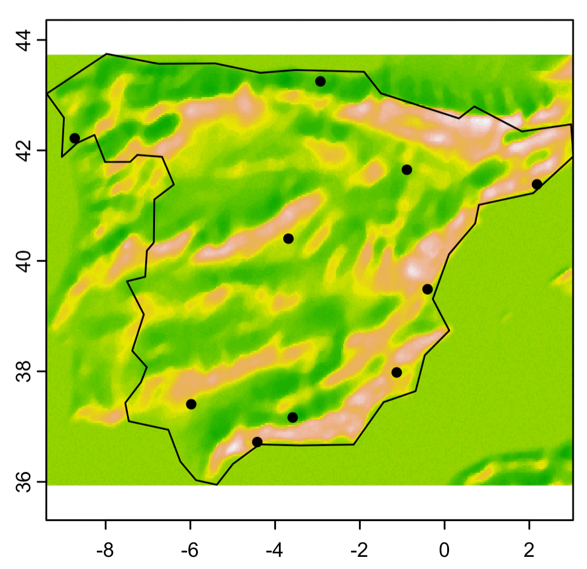

```{r setup, include=FALSE}
options(htmltools.dir.version = FALSE)

# library(xaringanthemer)
# # style_mono_accent(
# #   base_color = "#1c5253"
# #   # header_font_google = google_font("Josefin Sans"),
# #   # text_font_google   = google_font("Montserrat", "300", "300i"),
# #   # code_font_google   = google_font("Fira Mono")
# # )
# # style_xaringan(link_color = 'red')
# style_xaringan(
#   text_font_family = "Droid Serif",
#   text_font_url = "https://fonts.googleapis.com/css?family=Droid+Serif:400,700,400italic",
#   header_font_google = google_font("Yanone Kaffeesatz")
# )
# other colors:
# blue: rgb(0,114,178)
# orange: rgb(213,94,0)
# green: rgb(0,158,115)
```

class: inverse, center, title-slide, middle

<style>
.title-slide .remark-slide-number {
  display: none;
}
</style>

# Lecture 05: Spatial Data

## Theory and Tools (a.k.a. GIS Tools Lab.)

### <br><br>Bruno Conte

### 02/Oct/2023

---

# Spatial data in economics: schedule

1. ~~Introduction to (spatial) data and programming in `R`~~ [18.Sep.2023]

2. ~~Spatial data basics: vector data <span style="color: rgb(0,114,178)">+ assignment</span>~~ [21.Sep.2023]

3. ~~Basic operations with vector data <span style="color: rgb(0,114,178)">+ assignment</span>~~ [25.Sep.2023]

4. ~~Geometry operations and miscelanea <span style="color: rgb(213,94,0)">+ follow-up</span> <span style="color: rgb(0,114,178)">+ assignment</span>~~ [28.Sep.2023]

5. Raster data and operations <span style="color: rgb(0,114,178)">+ assignment</span> [02.Oct.2023]
    - Raster basics: creating and loading rasters with `terra`
    - Operations: unary and vector-raster tools
    - <span style="color: rgb(213,94,0)">Students' feedback survey</span><br> <br>

6. <span style="color: rgb(0,158,115)">Take-home exam</span> [03.Nov.2023]

---

# Main references for this class

1. Lovelace, R., Nowosad, J. and Muenchow, J., 2019. <span style="color: rgb(0,114,178)">**Geocomputation with R.**</span> Chapman and Hall/CRC.
  - Chapters 2.3, 3.3, 4.3, 5.3, and 6

2. Pebesma, E., 2018. Simple Features for R: Standardized Support for Spatial Vector Data. The R Journal 10 (1), 439-446

3. Wickham, H. and Grolemund, G., 2016. R for data science: import, tidy, transform, visualize, and model data. " O'Reilly Media, Inc.".

---

# Raster data: basics

- GIS systems represent <span style="color: rgb(0,114,178)">raster data</span> as an "image":
  - Geography as continuum of pixels (gridcells) with associated values
  
  - Normally represents <span style="color: rgb(213,94,0)">high resolution</span> features of the geography (like an image)

.center[

]

---

# Raster data: basics

- Normally represents <span style="color: rgb(213,94,0)">high resolution</span> features of the geography (like an image)

.center[

]

---

# Raster data (and other operations with rasters) in R

Requires additional libraries/packages than `sf`

1. `terra`: contains most of the raster-related functions

2. `exactextractr`: performs high-performance zonal statistics

3. `gdistance`: used to calculate distances over raster

---

# Raster basics: loading and creating with terra

- **Raster data:** represented with `terra`'s `SpatRaster` object

.center[]

---

# Raster basics: loading and creating with terra

Further details in `01_class05.R`, covering:

- **Creating or loading** it: with `terra::rast()` function

- **Unary operations:**
    - Cropping
    - Vectorization

- **Vector-raster operations:**
    - Ddata extraction
    - Zonal statistics
    - Rasterize
    - Distances over raster

---
class: inverse, center, middle
count: false

# Your turn: Hands-in

---

# Hands-in: your turn! (1/3)

.pull-left[
Dividing Italy in **gridcells**

- Create a 1 x 1 degree raster

- Convert it to polygon (i.e. create the grid)

- Use `world` data filtered to Italy, keep gridcells that **intersect** with Italy

- Visualize it:

]
.pull-right[
.center[]
]

---

# Hands-in: your turn! (2/3)

.pull-left[
Calculating **climate change** in USA

- Use the `us_states` data on the geography of US states

- Combine it with the SPEI index:
    - Retrieve average SPEI index across states
    - Do so for 3-4 different years

- Visualize it:

]
.pull-right[
.center[
<br>

]
]

---

# Hands-in: your turn! (3/3)

.pull-left[
Geography and **bilateral distances** in Spain

- Use the `ne_10m_populated_places` shapefile to retrieve the **10 top-populated places** in Spain

- Crop the elevation data from `MSR_50M.tif` raster with Spain

- Visualize them together with `plot()` function

- Calculate the path and distance between Madrid and Vigo
    - Hint: approx. 640 km!


]
.pull-right[
.center[

]
]

---
counter: false

# Hands-in: your turn! (3/3)

.pull-left[
Geography and **bilateral distances** in Spain

- Use the `ne_10m_populated_places` shapefile to retrieve the **10 top-populated places** in Spain

- Crop the elevation data from `MSR_50M.tif` raster with Spain

- Visualize them together with `plot()` function

- Calculate the path and distance between Madrid and Vigo
    - Hint: approx. 640 km!


]
.pull-right[
.center[

]
]

---
class: inverse, center, middle
count: false

# Your turn: Take-home

# Assignment

---

# Take-home assignment (1/2)

.pull-left[
Calculating **climate change** in USA

- Use the `us_states` data on the geography of US states

- Retrieve average SPEI index across **regions** for the past 50 years

- Retrieve the dataset as a panel (time series for each region)

- Plot the evolution of the SPEI index for each region
    - `geom_smooth()`: calculate the average across regions

]
.pull-right[
.center[

]
]

---

# Take-home assignment (2/2)

.pull-left[
<span style="color: rgb(0,114,178)">Transportation centrality</span> and isolation in Spain

- Use the `ne_10m_populated_places` shapefile to retrieve the **10 top-populated places**

- Crop the `ne_10m_roads` road data within Spain

- Build a raster/friction surface; calculate distances between **all city pairs**

- Bilateral distances if coming from Madrid vs. Vigo: <span style="color: rgb(213,94,0)">who is more isolated?</span>
    - `geom_density()`: calculates "smoothed" distributions
]
.pull-right[
.center[

]
]

---
counter: false

# Take-home assignment (2/2)

.pull-left[
<span style="color: rgb(0,114,178)">Transportation centrality</span> and isolation in Spain

- Use the `ne_10m_populated_places` shapefile to retrieve the **10 top-populated places**

- Crop the `ne_10m_roads` road data within Spain

- Build a raster/friction surface; calculate distances between **all city pairs**

- Bilateral distances if coming from Madrid vs. Vigo: <span style="color: rgb(213,94,0)">who is more isolated?</span>
    - `geom_density()`: calculates "smoothed" distributions
]
.pull-right[
.center[

]
]


